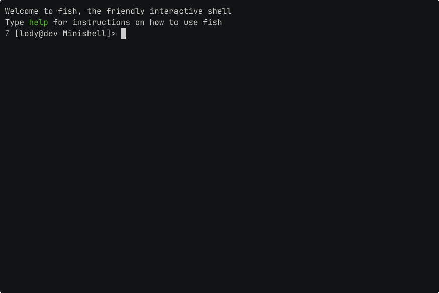

<div align="center">

# Minishell
A lightweight, POSIX-inspired UNIX command-line interpreter built entirely from scratch in C.

[](https://en.wikipedia.org/wiki/C_(programming_language))
[](https://www.linux.org/)
[]()

</div>

---

## Overview

`minishell` is a rigorous systems programming project designed to recreate the core execution behavior of GNU Bash. By implementing a fully functional shell from scratch, this project demonstrates a deep understanding of operating system mechanics, process lifecycle management, inter-process communication (IPC) via pipes, file descriptor manipulation, and safe asynchronous signal handling.

---

## Technical Features
### 1. Command Execution & Process Management
* **Interactive REPL:** Continuous Read-Eval-Print Loop featuring active command history.
* **Binary Resolution:** Dynamic executable resolution via the `PATH` environment variable, alongside absolute and relative path execution.
* **Process Synchronization:** Precise orchestration of child processes using `fork`, `execve`, and `waitpid`.

### 2. Parsing & Lexical Analysis
* **Stateful Parsing:** Robust handling of single quotes (`'`) for literal strings and double quotes (`"`) for interpolated strings.
* **Dynamic Expansion:** Environment variable expansion (`$VAR`) and accurate exit status reporting (`$?`).
* **Syntax Validation:** Graceful degradation and error handling for malformed syntax (e.g., unclosed quotes).

### 3. I/O Redirection & IPC
* **Pipelining:** Chained pipelines (`|`) correctly managing file descriptors across multiple concurrent child processes.
* **File Redirections:** Input (`<`), Output (`>`), and Append (`>>`) handling.
* **Here-Documents (`<<`):** Multi-line input streaming directly into command execution, with support for in-stream environment variable expansion.

### 4. Built-in Utilities
Modular, custom implementations of core shell commands engineered to execute directly within the parent process to manipulate the shell's environment state:
* `cd`
* `echo`
* `env`
* `exit`
* `export`
* `pwd`
* `unset`

---

## Developer Tooling: Interactive Token Debugger

To verify and debug the lexical analyzer, `minishell` includes a custom debug mode activated via the `-D` flag. This provides a real-time, visual breakdown of how input strings are sliced, categorized, and indexed before hitting the execution engine.

<p align="center">
  
</p>
---

## Signal Management

Custom asynchronous signal handlers ensure stability and responsiveness during execution:
* **`SIGINT` (`Ctrl-C`):** Safely halts the current process and displays a fresh prompt on a new line.
* **`EOF` (`Ctrl-D`):** Gracefully exits the shell while freeing all allocated heap memory.
* **`SIGQUIT` (`Ctrl-\`):** Safely ignored in interactive mode.

---

## Technical Competencies Demonstrated
* **Modular Code Architecture:** Built upon a robust, custom standard C library (**libft**), recycling modular memory utilities, linked lists, and string-parsing functions written from scratch.
* **System Calls:** Deep integration with low-level UNIX system calls for file descriptor management and process control.
* **Memory Management:** Rigorous tracking and clearing of heap allocations to prevent memory leaks and segmentation faults during string manipulation.
* **Data Structures:** Efficient management of environment variables, abstract syntax trees, and command tokens in C.
* **Concurrency:** Strict synchronization safeguards to prevent race conditions and deadlocks across piped execution streams.

---

## Build & Run Instructions

### Prerequisites
* GCC or Clang compiler
* GNU Make

### Compilation
```bash
# Clone the repository
git clone https://github.com/Juchu-In-Code/minishell.git
cd minishell

# Compile the project
make
```

### Execution
```bash
# Run in standard mode
./minishell

# Run in debug mode (Lexer visualization)
./minishell -D
```

### Makefile Targets
* `make` — Compiles the `minishell` binary.
* `make clean` — Removes object files.
* `make fclean` — Removes object files and the compiled executable.
* `make re` — Full project recompilation.

---

## References & Documentation

* [GNU Bash Manual](https://www.gnu.org/software/bash/manual/)
* [POSIX Shell Command Language Specifications](https://pubs.opengroup.org/onlinepubs/9699919799/utilities/V3_chap02.html)
* *The Linux Programming Interface* by Michael Kerrisk
* *Advanced Programming in the UNIX Environment* by W. Richard Stevens & Stephen A. Rago

---

## Authors

* **Julian Galizio** 
* **Lody Iaremko** 
